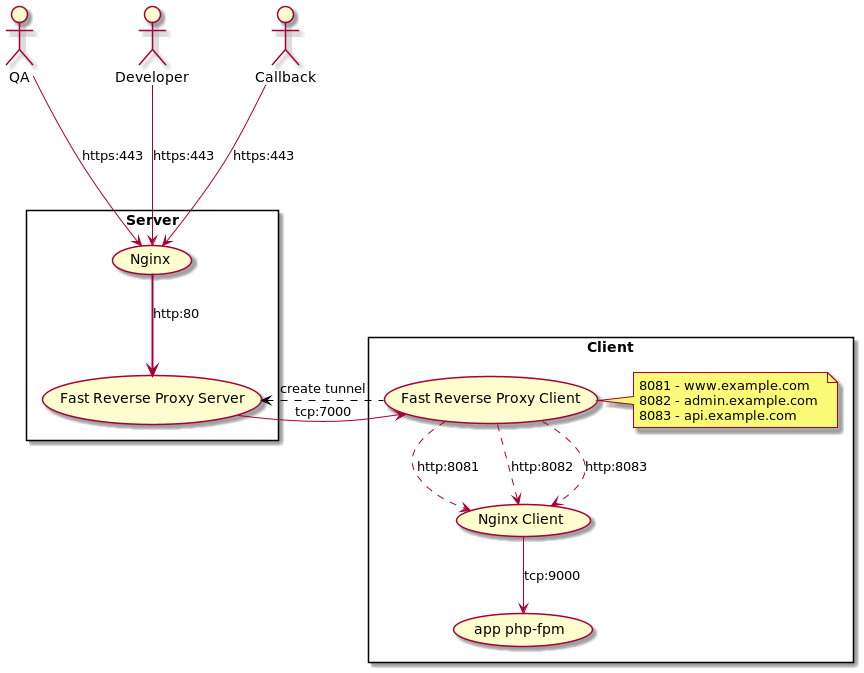

# Fast Reverse Proxy

https://github.com/fatedier/frp/

frp is a fast reverse proxy to help you expose a local server behind a NAT or firewall to the Internet. As of now, it supports TCP and UDP, as well as HTTP and HTTPS protocols, where requests can be forwarded to internal services by domain name.

frp also has a P2P connect mode.


---
### Schema

[](docs/img/schema.png)


### Server 
Run in docker 
```bash
  cd ./server
  cp .env.example .env
  docker build . -t frp
  docker run -d --restart unless-stopped --name frp-server --env-file .env -p 7000:7000 -p 7500:7500 frp
```
---
